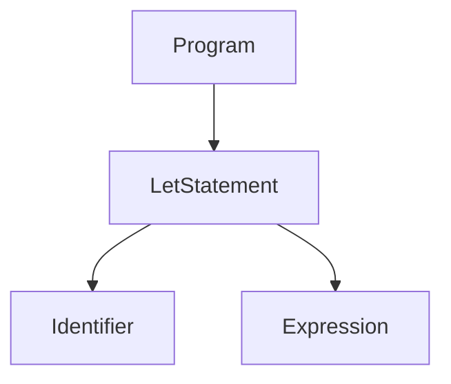

# Parser:
English and Spanish are SOV languages (Subject, Object, Verb), our structure is simple:
```python
bolado x = 5;
LesStament <Identifier> = __Expression__
```


# Building an interpreter

You learn [here](https://github.com/raulpenate/futebol/blob/main/info/README.md) more about the theory that I learned about building an interpreter.

### Installation
## Using script
Follow the steps below to install this language in your system.
- Clone the repository in your machine - 
```sh
git clone --depth=1 https://github.com/raulpenate/futebol
```
- Change to cloned directory and make `setup.sh` executable - 
```sh
cd futebol
chmod +x setup.sh
```

- Run `setup.sh` -
```sh
./setup.sh
```

## Manual installation

```python
python -m venv venv
source venv/bin/active
pip install -r requirements.txt
```

### Command to run my tests
```python
mypy . && python -m unittest discover  -p "*_test.py"
```

