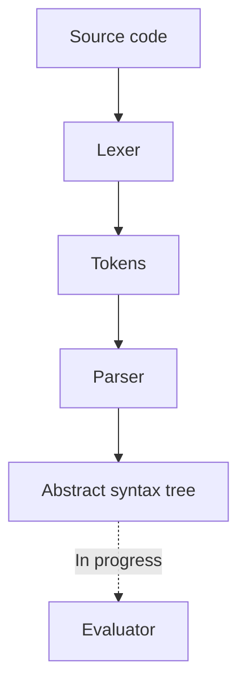

<p align="center">
  
</p>

# PyPususa

PyPususa is an educational interpreter project and joke programming language
inspired by urban Salvadoran Spanish. Its keywords use informal expressions
and street slang that Salvadorans may recognize from everyday conversations.
Some words may sound rude outside that playful context, so apologies in
advance—this project is meant with humor, not to offend anyone.

I am building PyPususa in Python to learn how source code moves through
lexing, parsing, an abstract syntax tree (AST), and eventually evaluation.

> PyPususa is a work in progress. The REPL currently tokenizes code and prints
> the resulting tokens; it does not execute programs yet.

## Language syntax

Variable declarations can use `bolado`, `chunche`, or `maje`:

```text
bolado cinco = 5;
chunche diez = 10;
maje resultado = cinco + diez;
```

The lexer also recognizes functions, conditionals, returns, and booleans:

```text
maje menor = mabe(x, y) {
    si (x < y) {
        vuelto simon;
    } tonces {
        vuelto nel;
    }
};
```

| PyPususa | Meaning |
| --- | --- |
| `bolado`, `chunche`, `maje` | Declare a variable |
| `mabe` | Declare a function |
| `si` | If |
| `tonces` | Else |
| `vuelto` | Return |
| `simon` | True |
| `nel` | False |

The parser currently builds the declaration and return statement structure,
but expression values, functions, and control flow are still in progress.


```mermaid
flowchart TD
    Source[Source code] --> Lexer[Lexer]
    Lexer --> Tokens[Tokens]
    Tokens --> Parser[Parser]
    Parser --> AST[Abstract syntax tree]
    AST -.->|In progress| Evaluator[Evaluator]
```

## Try the REPL

PyPususa has no runtime dependencies. To clone and start its lexer REPL:

```sh
git clone https://github.com/raulpenate/PyPususa.git
cd PyPususa
python3 main.py
```

Enter one line of PyPususa code to see its tokens:

```text
>> bolado x = 5;
Type: TokenType.LET, Literal: bolado
Type: TokenType.IDENT, Literal: x
Type: TokenType.ASSIGN, Literal: =
Type: TokenType.INT, Literal: 5
Type: TokenType.SEMICOLON, Literal: ;
```

Use `saquese()` to leave the REPL.

## Development

Create a virtual environment and install the current test and type-checking
tools:

```sh
python3 -m venv .venv
source .venv/bin/activate
python -m pip install mypy==1.11.1 typing_extensions
```

Run all checks:

```sh
mypy .
python -m unittest discover -p "*_test.py"
```

The repository's `requirements.txt` is not currently usable because its
`pynose` version uses invalid requirement syntax. The explicit development
install above works around that known issue.

## Learning notes and examples

- [How interpreters and compilers work](info/README.md) — my notes on lexing,
  parsing, ASTs, intermediate representations, optimization, and runtimes
- [Heap, stack, and memory leaks in C++](info/programming-concepts/README.md)
- [C++ stack and heap example](info/programming-concepts/stack-heap-example.cpp)

The interpreter notes are based on lessons from Robert Nystrom's
[_Crafting Interpreters_](https://craftinginterpreters.com/).

## Project status

| Done | In progress |
| --- | --- |
| Lexer for identifiers, integers, delimiters, and one- and two-character operators | Parsing expressions and declaration values |
| Salvadoran Spanish keywords and boolean literals | Capturing return values in the AST |
| Core AST nodes for programs, declarations, returns, and identifiers | Parsing functions, function calls, and `si`/`tonces` control flow |
| Parser support for declaration names and return statements | Evaluating the AST and managing runtime values |
| Interactive lexer REPL | Connecting the REPL to the parser and evaluator |
| Unit tests for the lexer, parser, and AST | — |
| Static type checking with `mypy` | — |
